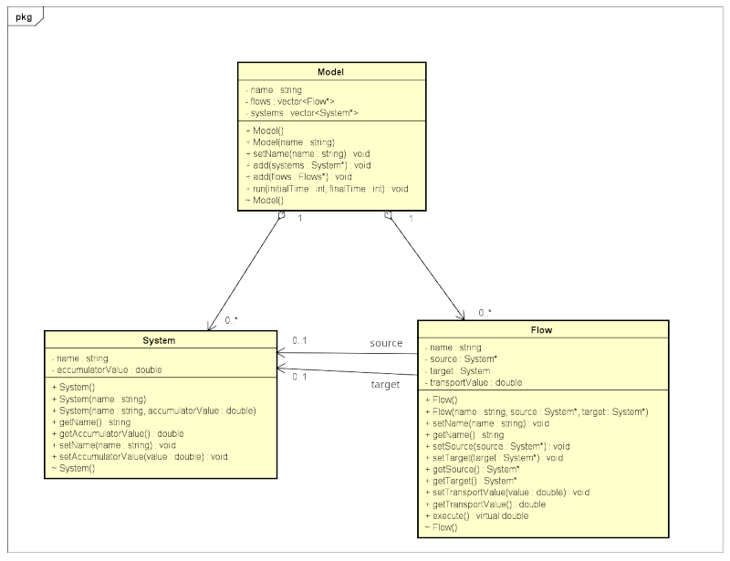

# MyVensim

## Introduction
API built for the Software Engineering I course at the Federal University of Ouro Preto. The API aims to simulate dynamic flow systems in a similar way to the Vensim software

## Structure
### UML

## Dependencies
- Gcc or another compiler for c++
- Cmake, make or another builder 

## Compilation and Installation
To use this API, follow these steps:

### Linux
1. Clone the repository: `git clone [https://github.com/thpablo/MyVensim_API]`
2. Run in root path: `make`
3. Run your code.